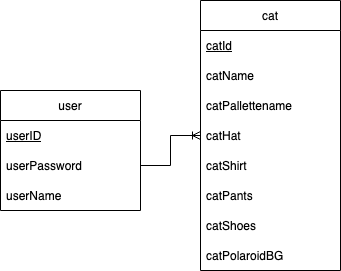

# node-mariadb-test

### About this project:

This project uses a nodeJS server connected to a mariaDB database, running a javascript game in the front end. Along with a team, I created the game 'cats with jobs' during Spring 2022 as a class project for Macalester College's COMP-225 (Software Development) course. I wrote the server, database, and javascript/html/css login page on my own following the conclusion of the course. The node server uses the expressJS framework. The frontend uses AJAX to handle logins and saving game information. This involved editing the original game in order to make https requests to the server. After editing the game files, I bundled them and used a shell script to quickly move the bundled "dist" folder into the correct location in the directory of the server. The login page is plain javascript/css/html (no frameworks are used). The javascript game was created using the Phaser framework and bundled via webpack before being included in this project. The server and database are running in separate docker containers on a digital ocean droplet. The database can be recreated using the 'cats_with_jobs_dump.sql' file (created using mysqldump).

NOTE: The reason that this repository has so few commits is because it was created in order to publish the project's code––the repository which I used while writing the project contained log in credentials in the dockerfile, which I wanted to keep private. I also ended up making some changes to the code after I deployed the project to digital ocean (adding Env variables and editing SQL queries), which I wanted to reflect in this reposity. This reposity is a copy of the server which is currently running, with login information removed.

The repository for the original javascript game can be found here: https://github.com/ecozbel/comp225-project-cats

The game is playable! It is hosted on a digital ocean droplet here: 164.92.90.211:8080
You can use the username 'Lisa' and the password 'password' to login. This user already has some cats stored in its gallery. You can also create a new account for a fresh start.

### Database Design:

The database design is extremely simple, with one relation each to store users and cats. There is a one-to-many relationship between user and cat. User is identified by userID, cat is identified by a combination of catID and userID. The node-mariadb connection sends a JSON file to the frontend. Within the game, the data is extracted from the recieved JSON and used to build a separate javascript object which represents the cat in the game world. 

While there is no set limit to the amount of cats which can be stored in the database, the game will only retrieve the most recent ten cats. This is because the original class project used the browsers local storage to store previous cats, and is only able to display ten cats at once in its "gallery" page. I wanted to learn new skills working on this project, so I decided not to alter the gallery page and focus on working on the server and database.

### Future Work:

- Currently, the project will store the username/password of a logged in user in session storage so that the game can make API calls to save and load information. It would be better to use a more secure method of storing credentials, perhaps JWT tokens.
- Currently, the database stores passwords in plaintext. For this reason I don't recommend using a password that you care about when using this project. In the future, the server should hash and salt the passwords before storing them.
- The error messages in the frontend are hard coded. It would be better to load them from a file so that the site can be localized more easily.
